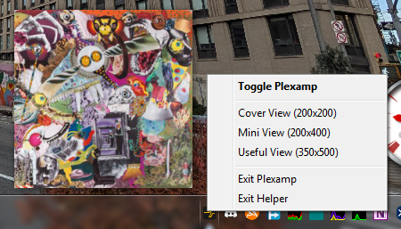
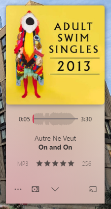
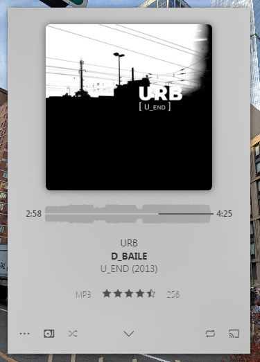

# Plexamp Tray
A little tool to make Plexamp behave like a taskbar tray app.



| Option                                | Action                                                                        |
|---------------------------------------|-------------------------------------------------------------------------------|
| Toggle Plexamp (default click action) | Minimizes Plexamp if open, restores it if closed, launches it if not running. |
| Cover View (200x200)                  | Resizes Plexamp to a 200px square, showing just the cover art.                |
| Mini View (200x400)                   | As above, but sets the height to 400px to show track information.             |
| Useful View (350x500)                 | Sets Plexamp to close to the default size, useful for browsing tracks.        |
| Exit Plexamp                          | Closes Plexamp, but keeps the tray app running.                               |
| Exit Helper                           | Closes the tray app, but keeps Plexamp running.                               |




When the tray app is running, it will adjust the window styles for Plexamp to remove it from the taskbar.

The app assumes you have Plexamp installed in the default directory:
```
C:\Users\[your username]\AppData\Local\Programs\Plexamp\Plexamp.exe
```

> [!NOTE]
> This was a vibe-coded (Gemini) script to put together a nice UX and clean up
> my taskbar. I'm sharing it because someone else might like it too. I'm not an
> AutoHotkey expert by any means, and I'm barely a novice. If something isn't
> working well, go ahead and make a pull request!